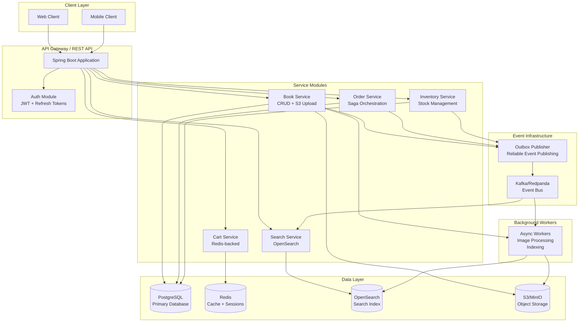
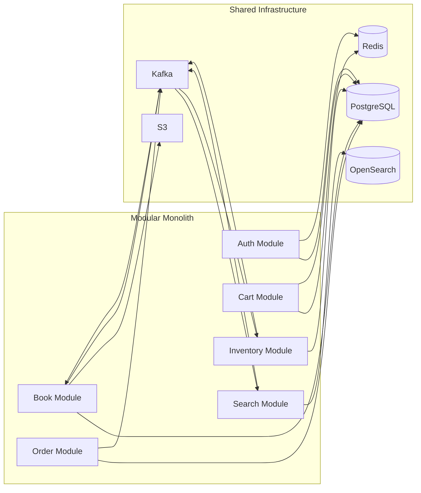
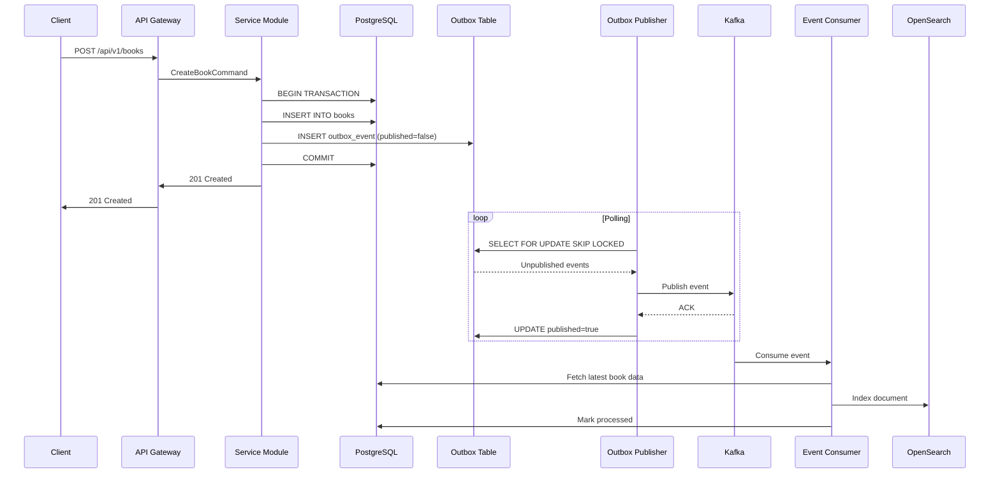
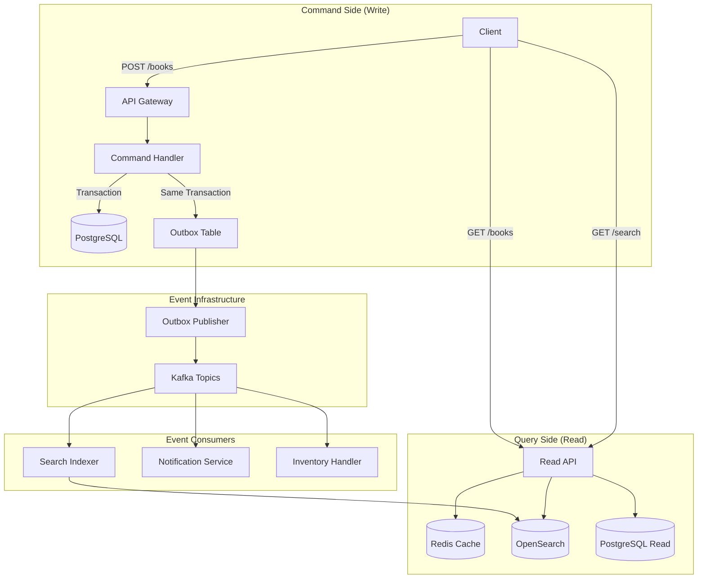
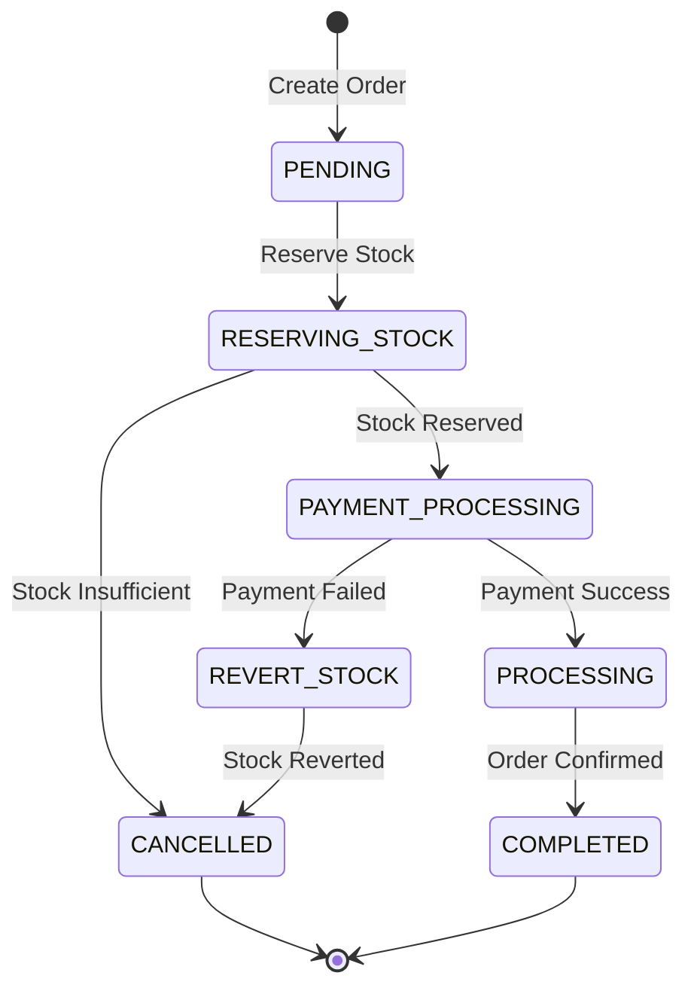
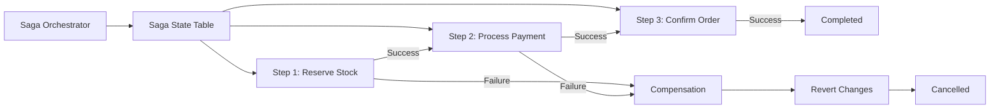
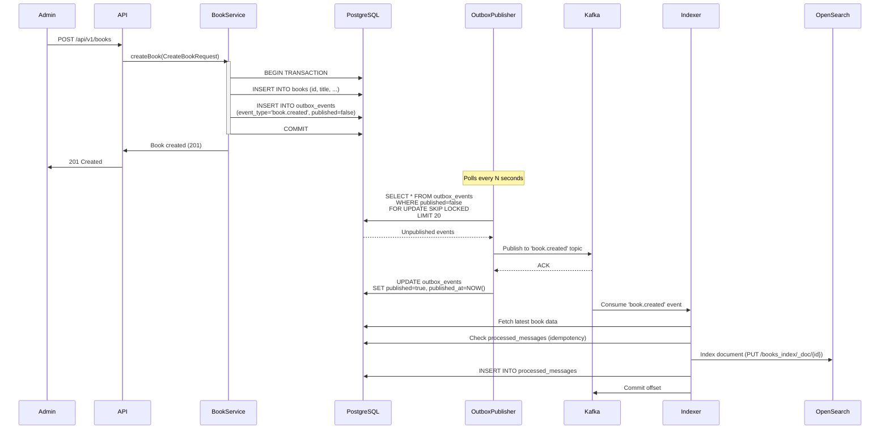

# 📚 BookStore 2.0

> **A modern, scalable e-commerce bookstore backend built with Java 25 & Spring Boot 3, demonstrating enterprise-grade architecture patterns, distributed systems design, and concurrency best practices.**

[](https://openjdk.org/)
[](https://spring.io/projects/spring-boot)
[](https://www.postgresql.org/)
[](https://kafka.apache.org/)
[](LICENSE)

---

## 🎯 Overview

BookStore 2.0 is a complete rebuild of a legacy Node.js bookstore application into a modern, enterprise-grade Java Spring Boot application. This project serves as a comprehensive demonstration of:

- **High-Level Design (HLD)** and **Low-Level Design (LLD)**
- **Object-Oriented Software Design (OOSD)** principles
- **Advanced concurrency** and **threading strategies**
- **Distributed system patterns**: Outbox Pattern, CQRS, Saga Orchestration
- **Event-driven architecture** with Kafka
- **Microservices-ready modular monolith** architecture

### Key Features

- 🔐 **Authentication & Authorization**: JWT-based auth with refresh tokens and role-based access control
- 📖 **Book Management**: Full CRUD operations with S3 multipart uploads for book covers
- 🔍 **Advanced Search**: OpenSearch integration for full-text search and autocomplete
- 🛒 **Shopping Cart**: Redis-backed cart with concurrency-safe operations
- 📦 **Order Management**: Transactional order creation with Saga orchestration
- 📊 **Inventory Management**: Real-time stock tracking with low-stock alerts
- 📡 **Event-Driven**: Kafka-based event bus for reliable event propagation
- 🚀 **Scalable Architecture**: Modular design ready for microservices migration

---

## 🏗️ High-Level Architecture (HLD)

### System Architecture Diagram



### Component Architecture



### Event Flow Architecture



---

## 🛠️ Technology Stack

### Core Technologies
- **Language**: Java 25 (with Project Loom features)
- **Framework**: Spring Boot 3.x
- **Build Tool**: Maven
- **Primary Database**: PostgreSQL 15+
- **Search Engine**: OpenSearch / Elasticsearch OSS
- **Cache & Session Store**: Redis
- **Message Broker**: Apache Kafka (Redpanda for local dev)
- **Object Storage**: S3-compatible (MinIO for local, AWS S3 for production)

### Spring Modules
- Spring Web (REST APIs)
- Spring Data JPA (Database access)
- Spring Security (Authentication & Authorization)
- Spring Kafka (Event streaming)
- Spring Cache (Redis caching)
- Spring Retry (Resilience)
- Spring Scheduler (Background jobs)

### Additional Libraries
- **Lombok**: Boilerplate reduction
- **MapStruct**: DTO mapping
- **Apache Tika**: File handling
- **Redisson**: Distributed locks

---

## 📊 Data Model

### PostgreSQL Schema

#### Core Tables

**users**
- `id` UUID (PK)
- `email` VARCHAR UNIQUE
- `password_hash` TEXT
- `roles` TEXT[]
- `is_active` BOOLEAN
- `created_at`, `updated_at` TIMESTAMPTZ

**books**
- `id` UUID (PK)
- `isbn` VARCHAR UNIQUE
- `title` TEXT
- `description` TEXT
- `author` VARCHAR
- `publisher` VARCHAR
- `published_date` DATE
- `price` NUMERIC(10,2)
- `stock` INT
- `cover_s3_key` TEXT
- `version` INT (optimistic locking)
- `created_at`, `updated_at` TIMESTAMPTZ

**cart_items**
- `id` UUID (PK)
- `user_id` UUID FK → users
- `book_id` UUID FK → books
- `quantity` INT
- UNIQUE(user_id, book_id)
- `created_at`, `updated_at` TIMESTAMPTZ

**orders**
- `id` UUID (PK)
- `user_id` UUID FK → users
- `total_amount` NUMERIC(12,2)
- `status` VARCHAR (PENDING, PROCESSING, COMPLETED, CANCELLED)
- `idempotency_key` VARCHAR UNIQUE
- `created_at`, `updated_at` TIMESTAMPTZ

**order_items**
- `id` UUID (PK)
- `order_id` UUID FK → orders
- `book_id` UUID FK → books
- `quantity` INT
- `price` NUMERIC(10,2)

**outbox_events** (Outbox Pattern)
- `id` UUID (PK)
- `aggregate_type` TEXT
- `aggregate_id` UUID
- `event_type` TEXT
- `payload` JSONB
- `published` BOOLEAN DEFAULT false
- `attempts` INT DEFAULT 0
- `created_at`, `published_at` TIMESTAMPTZ

### OpenSearch Index Mapping

```json
{
  "mappings": {
    "properties": {
      "id": { "type": "keyword" },
      "title": { "type": "text", "analyzer": "english" },
      "author": { "type": "text" },
      "description": { "type": "text", "analyzer": "english" },
      "price": { "type": "double" },
      "published_date": { "type": "date" },
      "isbn": { "type": "keyword" },
      "cover_s3_key": { "type": "keyword" },
      "suggest": { "type": "completion" }
    }
  }
}
```

---

## 🔌 API Design

### Authentication Endpoints

| Method | Endpoint | Description | Auth Required |
|--------|----------|-------------|---------------|
| `POST` | `/api/v1/auth/register` | Register new user | No |
| `POST` | `/api/v1/auth/login` | Login and get tokens | No |
| `POST` | `/api/v1/auth/refresh` | Refresh access token | No |
| `POST` | `/api/v1/auth/logout` | Logout (blacklist token) | Yes |

### Book Management Endpoints

| Method | Endpoint | Description | Auth Required |
|--------|----------|-------------|---------------|
| `POST` | `/api/v1/books` | Create new book | Admin |
| `GET` | `/api/v1/books/{id}` | Get book by ID | Yes |
| `PUT` | `/api/v1/books/{id}` | Update book | Admin |
| `DELETE` | `/api/v1/books/{id}` | Delete book | Admin |
| `GET` | `/api/v1/books` | List books (paginated) | Yes |
| `GET` | `/api/v1/search` | Search books (OpenSearch) | Yes |
| `POST` | `/api/v1/books/{id}/upload/start` | Start S3 multipart upload | Admin |
| `POST` | `/api/v1/books/{id}/upload/complete` | Complete multipart upload | Admin |

### Cart Endpoints

| Method | Endpoint | Description | Auth Required |
|--------|----------|-------------|---------------|
| `POST` | `/api/v1/cart/items` | Add/update cart item | Yes |
| `GET` | `/api/v1/cart` | Get current cart | Yes |
| `DELETE` | `/api/v1/cart/items/{itemId}` | Remove cart item | Yes |
| `POST` | `/api/v1/cart/checkout` | Checkout cart (create order) | Yes |

### Order Endpoints

| Method | Endpoint | Description | Auth Required |
|--------|----------|-------------|---------------|
| `GET` | `/api/v1/orders/{id}` | Get order details | Yes |
| `GET` | `/api/v1/orders` | List user orders | Yes |
| `POST` | `/api/v1/orders/{id}/cancel` | Cancel order | Yes |

### Admin Endpoints

| Method | Endpoint | Description | Auth Required |
|--------|----------|-------------|---------------|
| `GET` | `/api/v1/admin/low-stock` | List low stock books | Admin |
| `POST` | `/api/v1/admin/stock/adjust` | Adjust book stock | Admin |

---

## 🔄 CQRS & Event Flow

### CQRS Architecture Diagram



### Write Path Flow

1. **Client sends command** → `POST /api/v1/books`
2. **Command handler** persists to PostgreSQL within transaction
3. **Outbox event** written to `outbox_events` table (same transaction)
4. **Transaction commits** → guarantees consistency
5. **Outbox publisher** polls and publishes to Kafka
6. **Event consumers** process events asynchronously

### Read Path Flow

- **Simple queries**: Read from PostgreSQL (authoritative source)
- **Search queries**: Read from OpenSearch (full-text search, autocomplete)
- **Hot reads**: Cached in Redis for performance

### Eventual Consistency

- OpenSearch indexing is asynchronous (acceptable lag)
- Retry mechanisms ensure eventual consistency
- Idempotency prevents duplicate processing

---

## 🎭 Saga Orchestration

### Order Processing Saga Flow



### Saga Steps

1. **Create Order** (PENDING)
   - Create order record with `idempotency_key`
   - Write `order.created` event to outbox

2. **Reserve Stock**
   - Attempt to decrement stock atomically
   - `UPDATE books SET stock = stock - qty WHERE stock >= qty`
   - If fails → compensation

3. **Process Payment** (Simulated)
   - Call payment adapter
   - If fails → compensation

4. **Confirm Order**
   - Set status to PROCESSING → COMPLETED
   - Publish `order.confirmed` event

5. **Compensation Flow**
   - Restore reserved stock
   - Set order status to CANCELLED
   - Publish `order.cancelled` event

### Saga State Management



---

## 🔀 Outbox Pattern Flow

### Detailed Book Creation Flow



### Why Outbox Pattern?

- ✅ **Guaranteed delivery**: Events published only after DB commit
- ✅ **Transactional consistency**: Outbox insert in same transaction
- ✅ **Reliability**: Retry mechanism for failed publishes
- ✅ **Idempotency**: Prevents duplicate processing

---

## ⚡ Concurrency & Threading Strategy

### Thread Pool Configuration

```java
// Thread pools for different workloads
- TaskExecutor: corePoolSize=10, maxPoolSize=50, queueCapacity=500
- IOExecutor: larger pool for S3/network I/O
- CPUExecutor: limited to CPU count for CPU-intensive tasks
```

### Concurrency Patterns

#### 1. Optimistic Locking
- Use `@Version` field on entities
- Retry on `OptimisticLockException` with exponential backoff

#### 2. Pessimistic Locking
- `SELECT ... FOR UPDATE` for critical sections
- Use for stock decrement during checkout

#### 3. Distributed Locks (Redis)
- `SETNX` with TTL for distributed operations
- Used for cache rebuilds and scheduler tasks

#### 4. Atomic Operations
```sql
UPDATE books
SET stock = stock - :qty
WHERE id = :id AND stock >= :qty
```

#### 5. Idempotency
- `idempotency_key` on orders
- `processed_messages` table for event deduplication

### Concurrency Examples

**Add to Cart**
- DB transaction with unique constraint on `(user_id, book_id)`
- Optimistic retry on conflict

**Checkout**
- Pessimistic lock on stock rows
- Atomic stock decrement
- Create order and outbox event in same transaction

**Bulk Indexing**
- `ExecutorService` with bounded concurrency
- `CountDownLatch` for coordination
- Batch upserts to OpenSearch

---

## 🎨 Design Patterns

### Patterns Used

| Pattern | Usage | Implementation |
|---------|-------|----------------|
| **Repository** | Data access abstraction | Spring Data JPA Repositories |
| **Factory** | Complex object creation | `OrderFactory`, `BookFactory` |
| **Strategy** | Payment/fulfillment strategies | `PaymentStrategy` interface |
| **Template Method** | Common service workflows | `AbstractCrudService<T>` |
| **Observer** | Event handling | Spring `ApplicationEventPublisher` |
| **Command** | CQRS command handling | `CommandBus` + `CommandHandler` |
| **Unit of Work** | Transaction management | `@Transactional` + explicit UoW |
| **Saga** | Distributed transactions | Saga Orchestrator |
| **Adapter** | External service integration | `S3Adapter`, `OpenSearchAdapter` |

---

## 🚀 Getting Started

### Prerequisites

- Java 25 (or compatible JDK)
- Maven 3.8+
- PostgreSQL 15+
- Redis 7+
- Kafka/Redpanda
- OpenSearch/Elasticsearch
- MinIO (for S3-compatible storage)


## 📈 Deployment Considerations

### Runtime Configuration

- **JVM Tuning**: Configure heap size (`-Xms`, `-Xmx`) based on container resources
- **Thread Pools**: Tune executors per environment (dev/staging/prod)
- **Database Migrations**: Use Flyway or Liquibase for schema management
- **Monitoring**: Instrument metrics endpoints for observability (future)

### Docker Compose Services

- PostgreSQL (primary database)
- Redis (cache and sessions)
- Kafka/Redpanda (event bus)
- MinIO (object storage)
- OpenSearch (search engine)

---

## 📚 Key Concepts

### Outbox Pattern
Ensures reliable event publishing by storing events in the database within the same transaction as domain changes, then publishing asynchronously.

### CQRS (Command Query Responsibility Segregation)
- **Commands (Write)**: Modify state in PostgreSQL
- **Queries (Read)**: Read from PostgreSQL or OpenSearch based on query type

### Saga Pattern
Orchestrates distributed transactions across multiple services, with compensation logic for rollback scenarios.

### Event-Driven Architecture
Kafka-based event bus enables loose coupling between services and eventual consistency.

---

## 🔮 Future Enhancements
- [ ] Recommendation engine integration
- [ ] Advanced caching strategies


## 👨‍💻 Author

Built as part of a comprehensive learning project demonstrating enterprise-grade software architecture and design patterns.

---

## 📖 References

- [Spring Boot Documentation](https://spring.io/projects/spring-boot)
- [Apache Kafka Documentation](https://kafka.apache.org/documentation/)
- [OpenSearch Documentation](https://opensearch.org/docs/)
- [PostgreSQL Documentation](https://www.postgresql.org/docs/)

---

**Note**: This is an educational project demonstrating advanced software engineering concepts. For production use, additional considerations around security, monitoring, and scalability should be addressed.
